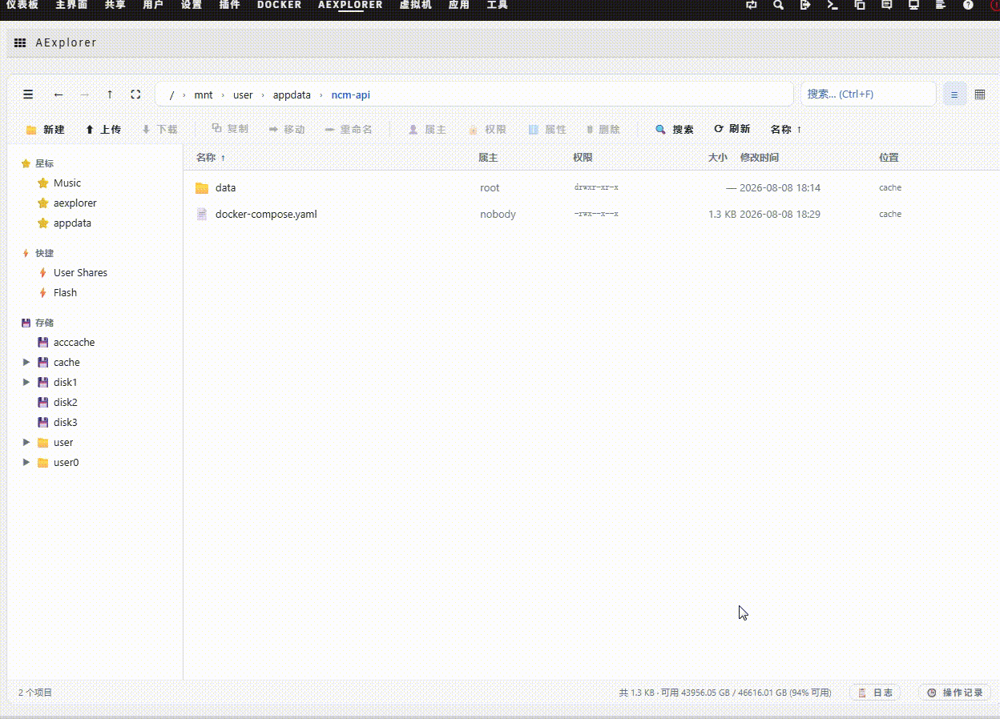
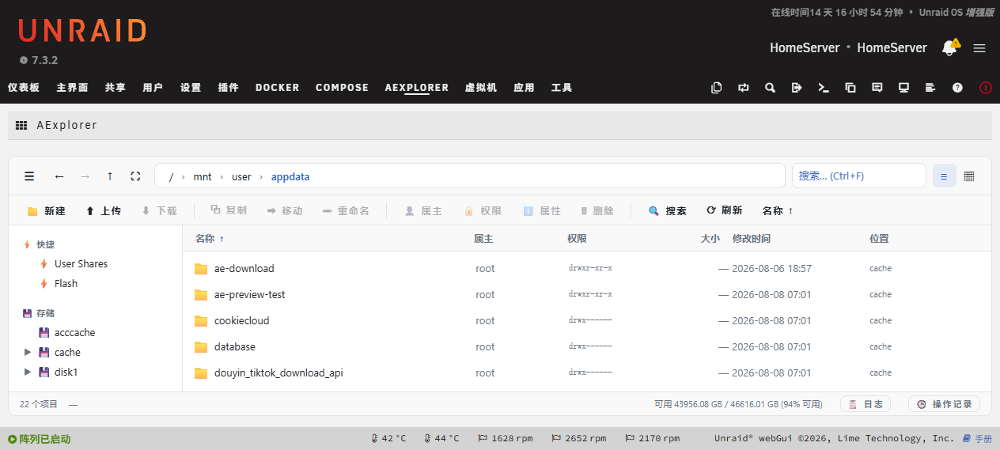
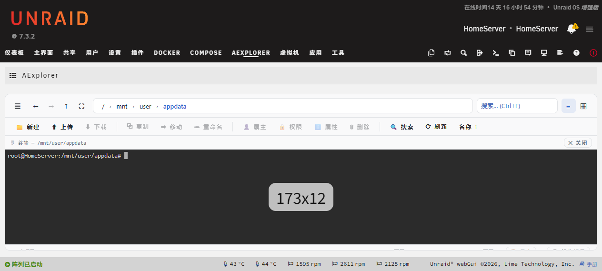
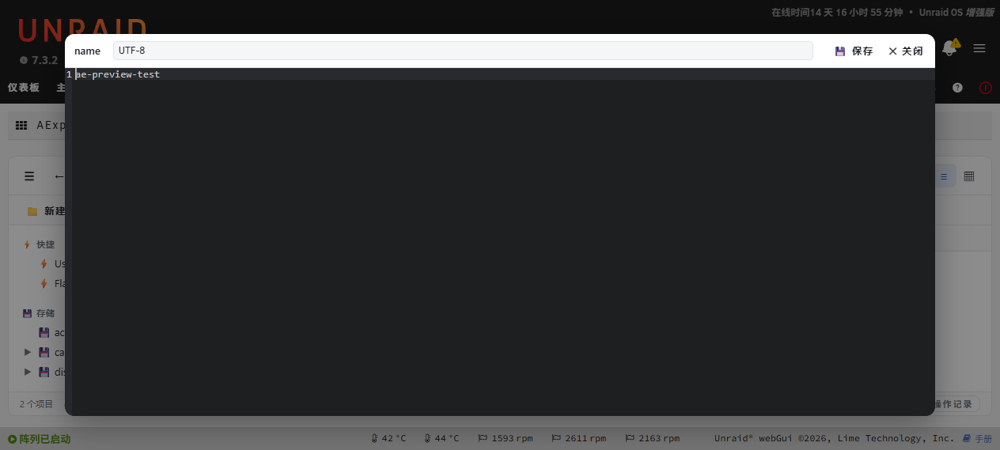

# 🦐 AExplorer

基于 **Unraid 7 内置 Dynamix File Manager** 重写的文件管理器：保留官方全部后端机制（Control.php 协议 / nchan 任务队列 / ACE 编辑器），前端重写为 **Windows 11 资源管理器风格**（原生 JS + 虚拟滚动，本地 vendor 库零外网依赖）。

 

**[中文](README.md) | [English](README.en.md)**

> 🤖 **Powered by AI** — 本项目由 AI 智能体（Nous Research Hermes）辅助开发、调试与维护。

## 🖼 效果图

## 📚 文档

- **设计文档**（架构/功能清单/安全设计/变更历史）：`docs/DESIGN.md`
- **英文版**：`docs/DESIGN.en.md`

## 🧭 快捷键

`F5` 刷新 · `F2` 重命名 · `Delete` 删除 · `Ctrl+F` 搜索 · `Ctrl+A` 全选 · `Backspace` 上级 · `Alt+←/→/↑` 导航 · 鼠标侧键 后退/前进 · `Ctrl+1/2` 视图 · **字母键 首字母选中**（type-ahead）
